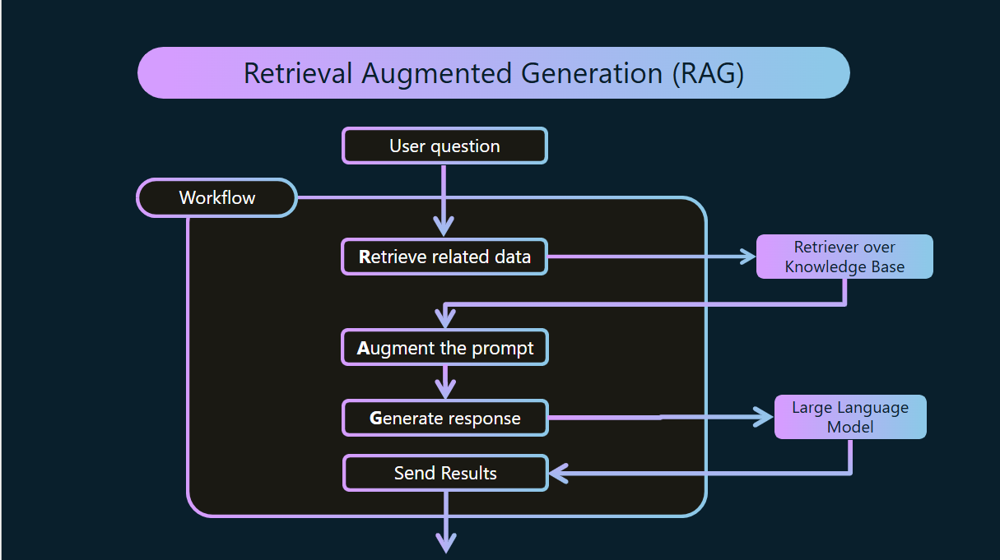
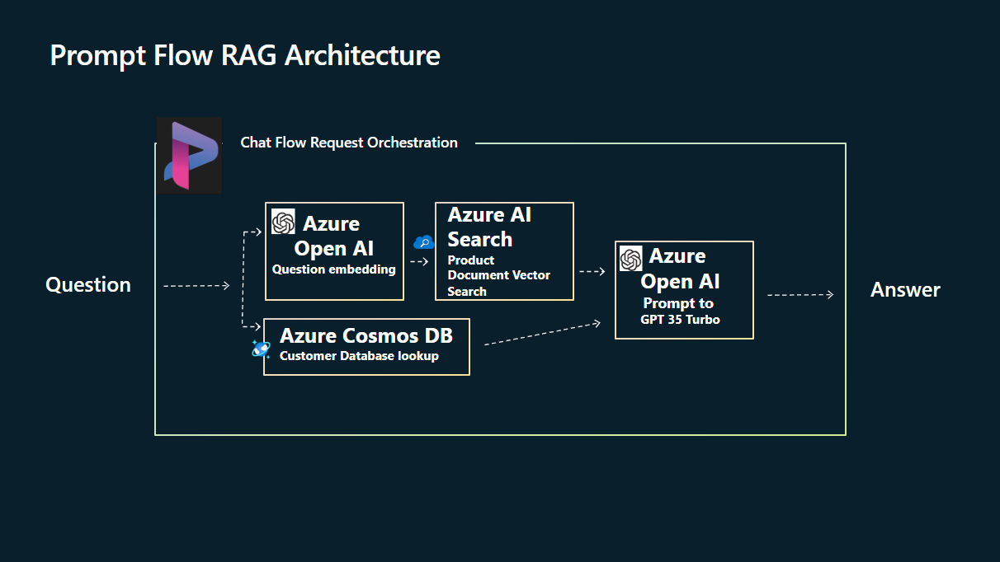
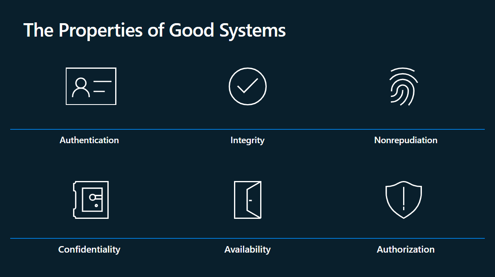
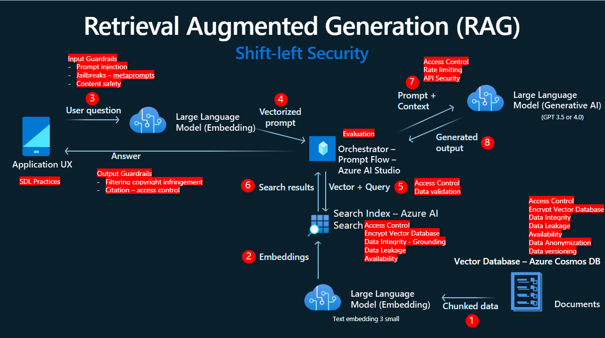
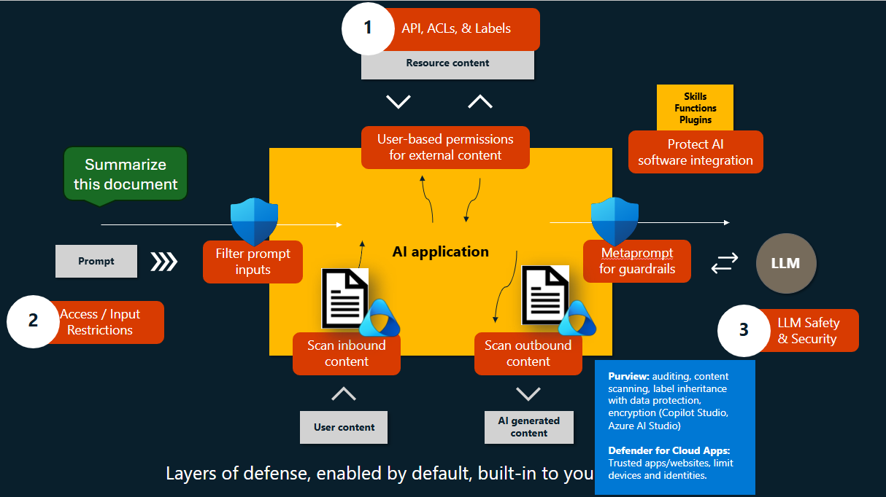

# Welcome

In this workshop,

## Goals

You'll learn how to:

## Prerequisites

What you need for the session

---

# Introduction

## Overview of RAG

Retrieval Augmented Generation (RAG) is a popular application pattern for Large Language Models (LLMs), where you add context to LLM applications, which is crucial in providing context.

The RAG pattern involves three main steps:

1. Retrieve: Start with a user question (prompt) and send it to an information retrieval system to find relevant information.
2. Augment: The top-ranked search results from the retrieval step are used to add context to the prompt
3. Generate: Use the natural language understanding and reasoning capabilities of the LLM to generate a response to the user question.

This pattern allows querying your data, finding matches relevant to a user query, and using these results to enrich the context passed to the LLM. It helps in answering user queries not covered in the LLM’s training data and prevents hallucinations.

Another approach to adding context to LLM apps is fine-tuning. However, fine-tuning is more complex, requires greater skills, and is more upfront expensive.

> Please note that this is a simplified explanation of RAG. In practice, the implementation of RAG can be much more complex.

## PromptFlow RAG Architecture

The Azure AI platform, centered around Azure AI Studio, provides a comprehensive suite of tools and resources for building AI projects. One of these resources is PromptFlow, which is specifically designed for building, evaluating, and deploying Retrieval Augmented Generation (RAG) based Large Language Model (LLM) applications.

Here’s how RAG is implemented in PromptFlow:

- **Azure AI Studio:** This unified web portal allows you to explore models, capabilities, samples, and responsible AI tools. It provides ability to manage Azure AI resources and offers UI-based development flows to build your Azure AI projects. It also supports code-first development through Azure AI SDK and PromptFlow.

-**PromptFlow:** This tool is used to build, evaluate, and deploy LLM applications. It additionally, leverages the RAG pattern to augment prompts with additional context, enhancing the LLM’s ability to generate more accurate and relevant responses.

-**Visual Studio Code:** This platform can be used with Azure and PromptFlow extensions, as well as GitHub Copilot and Jupyter Notebook extensions, to facilitate the development process.

-**Responsible AI:** Provides guidance and tools for responsible usage of prompts such as built-in support for content filtering. This ensures that the AI applications built are not only effective but also ethical and responsible.

## Threat modelling RAG application
Threat modelling is a structured approach to identify, quantify, and address the security risks associated with an application. Here’s how it can be applied to Retrieval Augmented Generation (RAG) applications:

- **Design:** The first step involves capturing all the requirements for your RAG application including understanding the data flow, the components involved, and how they interact with each other. 

- **Break:** Once the design is in place, a threat-modelling framework is applied to the data-flow diagram. This process helps in identifying potential security issues that could arise in the system. The goal here is to think like an attacker and identify all possible ways the system could be exploited.

- **Fix:** After identifying potential security issues, the next step is to decide how to address each one of them. This is done by implementing the right combination of security controls. These controls could range from encryption and access controls to intrusion detection systems and firewalls.

- **Verify:** The final step is to verify that all the requirements are met, all identified issues are addressed, and all the security controls are correctly implemented. This could involve various testing and validation methods to ensure the security of the RAG application.

In summary, threat modelling for RAG applications involves a systematic process of designing, breaking, fixing, and verifying the system to ensure its security. This process helps in proactively identifying and mitigating potential security threats, thereby enhancing the overall security posture of the RAG application.

---
# RAG Security Controls

---
# Application Security

---
# Data Security Implementation

---
# Defender for Cloud in AI

---
# Conclusion

